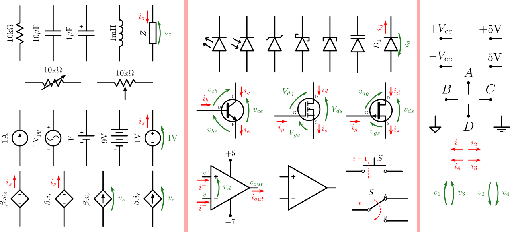
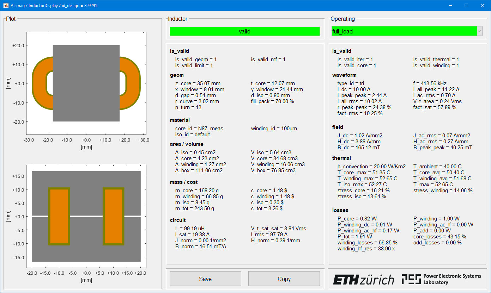
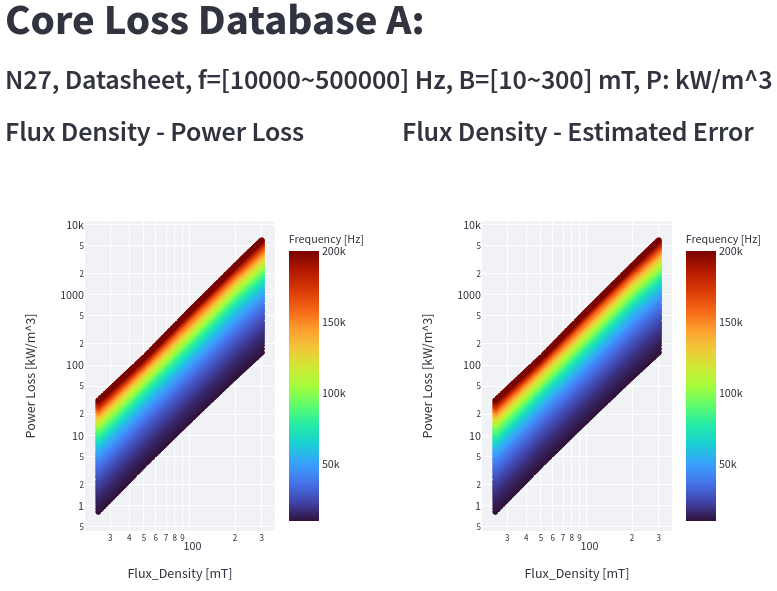
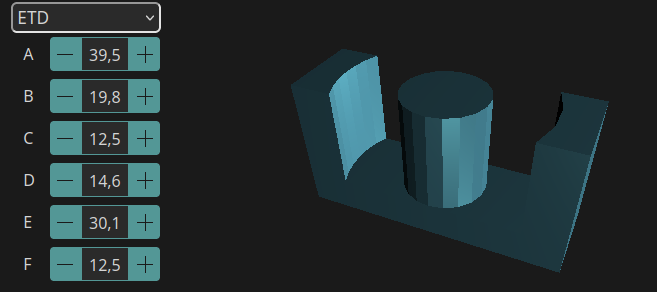
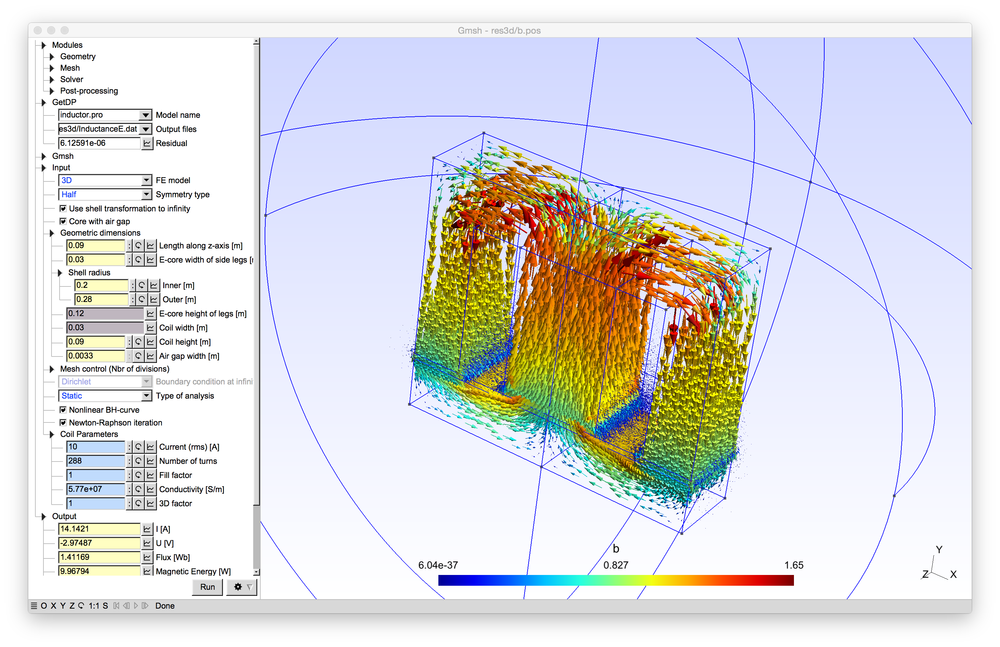
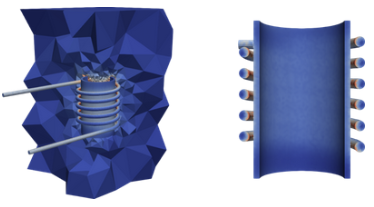
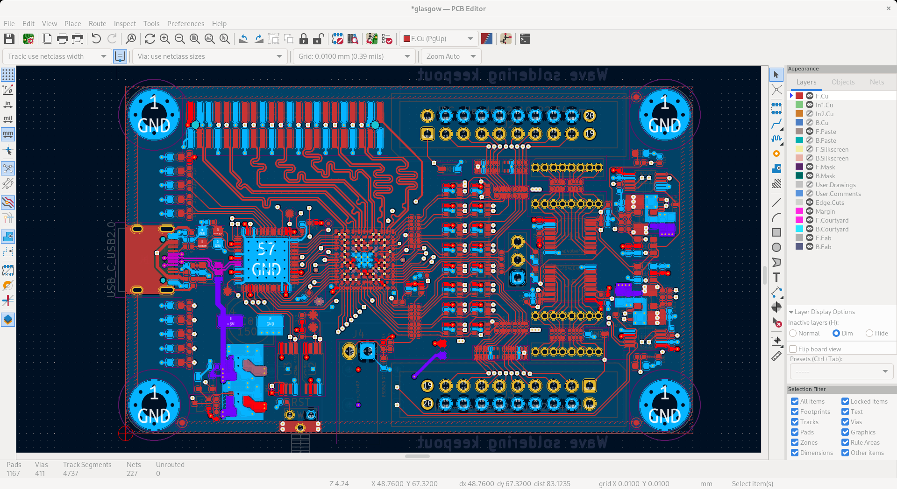
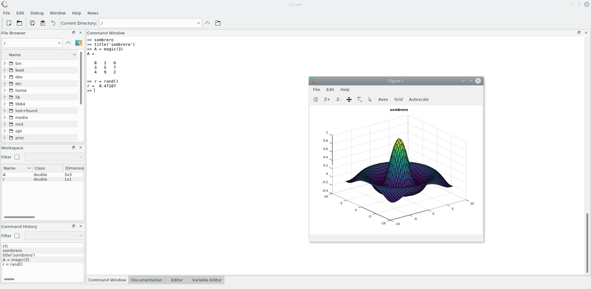

# Open-Source-Power-Electronic-Tools
Lists open source tools for power electronic engineers.

Missing Tool? -> Open an Issue or open a pull request.

## Table of Contents

- [Circuit Simulation and Calculation](#drawing-and-documentation)
- [Drawing and Documentation](#drawing-and-documentation)
- [Magnetics](#magnetics)
- [Schematics and Layout](#schematics-and-layout)
- [Calculation and Automatisation](#Calculation-and-automatisation)

## Circuit Simulation and Calculation

| Name | Description | Link | Screenshot |
|------|-------------|------|--------|
| [GeckoCIRCUITS](https://github.com/geckocircuits/GeckoCIRCUITS) | GeckoCIRCUITS is a fast and easy-to-use circuit simulator optimized for power electronics. |  <ul><li><a href="https://de.wikipedia.org/wiki/GeckoCircuits">Wikipedia</a></li> <li> <a href="https://github.com/geckocircuits/GeckoCIRCUITS">GitHub</a></li> </ul> | |
| [transistordatabase](https://github.com/upb-lea/transistordatabase) | A unified software engineering tool for managing and evaluating power transistors |  <ul> <li> <a href="https://upb-lea.github.io/transistordatabase/main/index.html">Documentation</a></li> <li><a href="https://pypi.org/project/transistordatabase/">PyPI</a></li></ul> |  |

## Drawing and Documentation

| Name | Description | Link | Screenshot |
|------|-------------|------|-------|
| [Inkscape Circuit Symbols (Inkscape Extension)](https://github.com/fsmMLK/inkscapeCircuitSymbols) | Circuit Symbols as Inkscape extension | <ul><li> <a href="https://github.com/fsmMLK/inkscapeCircuitSymbols">GitHub</a></li> </ul> ||
| [Inkscape Electric Symbols](https://github.com/upb-lea/Inkscape_electric_Symbols) | Electrical symbol library for the vector graphics program Inkscape. | <ul><li> <a href="https://github.com/upb-lea/Inkscape_electric_Symbols">GitHub</a></li> </ul> ||

## Magnetics
| Name | Description | Link | Screenshot |
|------|-------------|------|-------|
| [AI-mag](https://ai-mag.github.io/) | Inductor Modeling and Design using Artificial Neural Network and Finite Element Method |  <ul><li> <a href="https://github.com/ethz-pes/AI-mag">GitHub</a></li> </ul> | |
| [FEMMT](https://github.com/upb-lea/FEM_Magnetics_Toolbox) | Python toolbox to generate preconfigured structures for FEM simulation tools in power electronics |  <ul><li> <a href="https://github.com/upb-lea/FEM_Magnetics_Toolbox">GitHub</a></li> </ul> | |
| [GetDP](https://getdp.info/) | GetDP is a free finite element solver using mixed elements to discretize de Rham-type complexes in one, two and three dimensions. |  <ul><li> <a href="https://gitlab.onelab.info/getdp/getdp">GitLab</a></li> </ul> | |
| [Gmsh](https://gmsh.info/) | Gmsh is an open source 3D finite element mesh generator with a built-in CAD engine and post-processor |  <ul><li><a href="https://en.wikipedia.org/wiki/Gmsh">Wikipedia</a></li><li> <a href="https://gitlab.onelab.info/gmsh/gmsh">GitLab</a></li> </ul> | |
| [Litz Wire Losses with FEM and MATLAB](https://github.com/ethz-pes/litz_wire_losses_fem_matlab) | Litz Wire Losses with FEM and MATLAB | <ul><li> <a href="https://github.com/ethz-pes/litz_wire_losses_fem_matlab">GitHub</a></li> </ul> | |
| [Magnet](https://mag-net.princeton.edu/) | Data Driven Methods for Magnetic Core Loss Modeling |  <ul><li> <a href="https://github.com/PrincetonUniversity/Magnet">GitHub</a></li> </ul> | |
| [Magnetic Components Toolbox MATLAB](https://github.com/otvam/magnetic_components_toolbox_matlab) | MATLAB Toolbox for Power Magnetics: Model and Optimization  |  <ul><li> <a href="https://github.com/otvam/magnetic_components_toolbox_matlab">GitHub</a></li> </ul> | |
| [Magnetic Mirroring Method with MATLAB](https://github.com/ethz-pes/mirroring_method_matlab) | Magnetic Mirroring Method with MATLAB  |  <ul><li> <a href="https://github.com/ethz-pes/mirroring_method_matlab">GitHub</a></li> </ul> | |
| [MAS](https://openmagnetics.com/) | Magnetic Agnostic Structure (MAS) is a project providing a common language for defining any kind of magnetic for power electronics. |  <ul><li><a href="https://openmagnetics.com/">Homepage</a></li><li> <a href="https://github.com/OpenMagnetics/MAS">GitHub</a></li> </ul> | |
| [ONELAB](https://www.onelab.info/) | ONELAB is an open-source, lightweight interface to finite element software |  <ul><li> <a href="https://gitlab.onelab.info/explore/projects">GitLab</a></li> </ul> | |
| [Sparselizard](https://www.sparselizard.org/) | FEM simulation software |  <ul><li> <a href="https://github.com/halbux/sparselizard/">GitHub</a></li> </ul> | |

## Schematics and Layout
| Name | Description | Link | Screenshot |
|------|-------------|------|-------|
| [KiCad](https://www.kicad.org/) | Schematic and layout editor. |  <ul><li><a href="https://en.wikipedia.org/wiki/KiCad">Wikipedia</a></li><li> <a href="https://gitlab.com/kicad">GitLab</a></li> </ul> | |

## Calculation and Automatisation
| Name | Description | Link | Screenshot |
|------|-------------|------|-------|
| [Octave](https://www.gnu.org/software/octave/) | Scientific programming language |  <ul><li><a href="https://en.wikipedia.org/wiki/GNU_Octave">Wikipedia</a></li><li> <a href="https://gitlab.com/gnu-octave/octave">GitLab</a></li> </ul> | |
| [Python](https://www.python.org/) | Programming language |  <ul><li><a href="https://en.wikipedia.org/wiki/Python_(programming_language)">Wikipedia</a></li><li> <a href="https://github.com/python/">GitHub</a></li> </ul> | |
